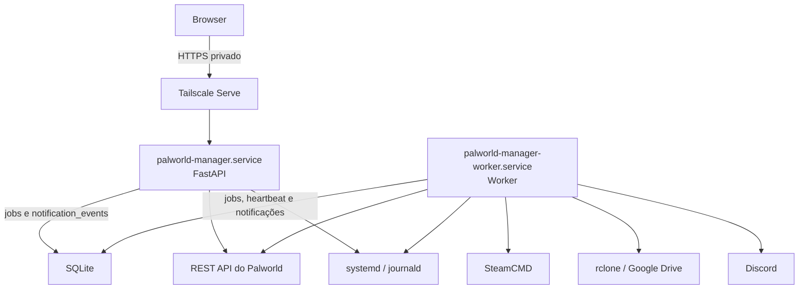

# Visão geral da arquitetura

> Status: Em desenvolvimento. A base FastAPI/Jinja2, o layout Tailwind, as métricas efêmeras, o health check, os controles de ciclo de vida e o desligamento assistido do Palworld estão implementados; integrações e regras operacionais adicionais permanecem planejadas.

O Palworld Manager é uma aplicação Python leve e modular por domínio. FastAPI coordena as rotas e os serviços da aplicação; Jinja2 renderiza as páginas no servidor; HTMX atualiza as métricas e atualizará outros formulários e fragmentos; e SSE entregará logs e progresso que se beneficiem de atualização contínua. Tailwind CSS fornece o layout administrativo responsivo; Chart.js exibe o histórico de 15 minutos mantido somente em memória.

SQLite será o banco do Manager, acessado por SQLAlchemy e versionado por migrations do Alembic. Também funcionará como fila e mecanismo persistente de coordenação entre a aplicação web e um worker Python independente. O worker processará jobs como backup, restore e update sob um maintenance lock para impedir operações incompatíveis.

Em produção, `palworld-manager.service` executará o FastAPI e a interação web, enquanto `palworld-manager-worker.service` consumirá e executará jobs. Ambos rodarão como `palmanager`, nunca como `root`, e serão controlados por systemd. O worker acionará SteamCMD e rclone para operações demoradas e será o único componente autorizado a entregar notificações ao Discord. Tailscale Serve publicará somente a aplicação web, que escutará em localhost, e journald receberá os logs dos dois serviços.

O serviço web cria e acompanha jobs, mas não executa diretamente operações longas ou destrutivas destinadas ao worker. Redis, Celery, RabbitMQ e Kafka não fazem parte da V1.

Qualquer componente pode persistir um `notification_event`; somente o worker muda a entrega para execução e chama o Discord. FastAPI não envia ao webhook diretamente. A entrega é at least once: um evento deixado em `SENDING` após interrupção volta a `PENDING` quando ainda houver tentativa disponível, portanto uma mensagem pode ser entregue mais de uma vez.

O worker não terá servidor HTTP. Sua saúde será derivada do systemd e de um heartbeat gravado no SQLite a cada 10 segundos. Enquanto o serviço estiver ativo e ainda não houver heartbeat, ficará `STARTING` com menos de 30 segundos desde a ativação e `UNRESPONSIVE` a partir de 30 segundos. Com heartbeat, idade inferior a 30 segundos é `HEALTHY` e idade igual ou superior é `UNRESPONSIVE`; serviço inativo é `OFFLINE`. O `/health` pertence exclusivamente à aplicação web.

Dev e testes usam fakes nas integrações já implementadas e usarão serviços simulados nas próximas fronteiras externas. Consulte a [especificação da V1](../../SPECIFICATION.md) para os requisitos e a [documentação Docker](../development/docker.md) para o ambiente planejado.

A saúde do Palworld fica atrás de uma interface única. Em produção, combina `ActiveState`, o processo associado ao `MainPID` e o endpoint oficial autenticado `GET /info`; somente os três sinais saudáveis produzem `ONLINE`. Em development e test, fakes controláveis substituem integralmente systemd, processo e REST API. A matriz completa está em [Health check do Palworld](palworld-health.md).
