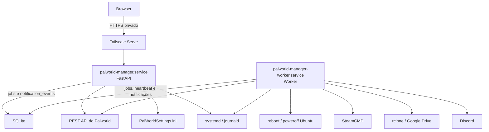

# Visão geral da arquitetura

> Status: Em desenvolvimento. A base FastAPI/Jinja2, o layout Tailwind, métricas, health checks, controles do Palworld e do host Ubuntu, logs, integração REST administrativa, editor do INI, backup/Restore local e remoto via rclone, Update manual via SteamCMD, Discord, configurações operacionais, diagnóstico, auditoria, instalação nativa e deploy recorrente estão implementados; o hardening final permanece planejado.

O Palworld Manager é uma aplicação Python leve e modular por domínio. FastAPI coordena as rotas e os serviços da aplicação; Jinja2 renderiza as páginas no servidor; HTMX atualiza as métricas e atualizará outros formulários e fragmentos; e SSE já entrega logs em tempo real com reconexão por cursor. Tailwind CSS fornece o layout administrativo responsivo; Chart.js exibe o histórico de 15 minutos mantido somente em memória.

SQLite é o banco do Manager, acessado por SQLAlchemy e versionado por migrations do Alembic. Também funciona como fila e mecanismo persistente de coordenação entre a aplicação web e um worker Python independente. O worker processa ações de ciclo de vida, energia do host, backup/Restore local ou remoto, transferências do Google Drive e Update manual via SteamCMD sob coordenação persistente e maintenance lock quando necessário.

Em produção, `palworld-manager.service` executa o FastAPI e a interação web, enquanto `palworld-manager-worker.service` consome e executa jobs. Ambos rodam como `palmanager`, nunca como `root`, e são controlados por systemd. O worker aciona SteamCMD e rclone para operações demoradas e é o único componente autorizado a entregar notificações ao Discord. Tailscale Serve publica somente a aplicação web, que escuta em localhost, e journald recebe os logs dos dois serviços.

O serviço web cria e acompanha jobs, mas não executa diretamente operações longas ou destrutivas destinadas ao worker. Redis, Celery, RabbitMQ e Kafka não fazem parte da V1.

Qualquer componente pode persistir um `notification_event`; somente o worker muda a entrega para execução e chama o Discord. FastAPI não envia ao webhook diretamente. A entrega é at least once: um evento deixado em `SENDING` após interrupção volta a `PENDING` quando ainda houver tentativa disponível, portanto uma mensagem pode ser entregue mais de uma vez.

O worker não tem servidor HTTP. Sua saúde é derivada do systemd e de um heartbeat gravado no SQLite a cada 10 segundos. Enquanto o serviço estiver ativo e ainda não houver heartbeat, fica `STARTING` com menos de 30 segundos desde a ativação e `UNRESPONSIVE` a partir de 30 segundos. Com heartbeat, idade inferior a 30 segundos é `HEALTHY` e idade igual ou superior é `UNRESPONSIVE`; serviço inativo é `OFFLINE`. O mesmo registro impede uma segunda identidade enquanto o lease estiver recente. O `/health` pertence exclusivamente à aplicação web.

O domínio de diagnóstico executa somente leituras e não usa o maintenance lock.
Ele reutiliza health, métricas e logs redigidos, combina sinais controlados do
host e lê do SQLite os últimos checks externos executados pelo worker. Dessa
forma, a aplicação web não chama SteamCMD, rclone ou Discord para montar o
relatório. Development e test substituem também os sinais de host por fakes.

Dev e testes usam fakes nas integrações implementadas. O cliente fake da REST API oferece info, jogadores, anúncios, Kick, Ban, Unban, salvamento seguro e falhas controláveis sem rede. O payload fake de backup contém mundo, `Players/` e INI representativos sem ler os paths estruturais do host; somente a área temporária controlada do Manager e um SQLite isolado são usados. O `mock-services` também expõe os contratos oficiais simulados já confirmados. Consulte a [especificação da V1](../../SPECIFICATION.md) para os requisitos e a [documentação Docker](../development/docker.md) para o ambiente planejado.

A saúde do Palworld fica atrás de uma interface única. Em produção, combina `ActiveState`, o processo associado ao `MainPID` e o endpoint oficial autenticado `GET /info`; somente os três sinais saudáveis produzem `ONLINE`. Em development e test, fakes controláveis substituem integralmente systemd, processo e REST API. A matriz completa está em [Health check do Palworld](palworld-health.md).

A consulta administrativa usa o mesmo contrato REST tipado, sem compartilhar segredos com a UI. `GET /players` só é chamado após ação manual ou por uma operação que realmente precise da lista; a página apenas lê um snapshot com timestamp mantido na memória do processo web. `POST /announce` exige sessão, CSRF e confirmação literal do texto antes de enviar. Kick, Ban e Unban também exigem sessão, CSRF e o modal compartilhado; Ban e Unban recusam motivo vazio. Essas ações persistem histórico administrativo e auditoria, sem tratar o SQLite como autoridade sobre o estado de Ban do Palworld.

O editor do `PalWorldSettings.ini` mantém parsing, validação tipada e storage atrás de interfaces próprias. Production lê o arquivo estrutural configurado, rejeita symlinks, exige uma versão ainda atual, cria uma cópia protegida antes de salvar e substitui o conteúdo atomicamente; development e test usam somente memória. Valores sensíveis e desconhecidos nunca chegam aos campos editáveis. O comportamento completo está em [Editor do PalWorldSettings.ini](../integrations/palworld-settings-ini.md).
